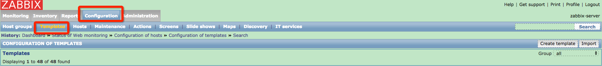
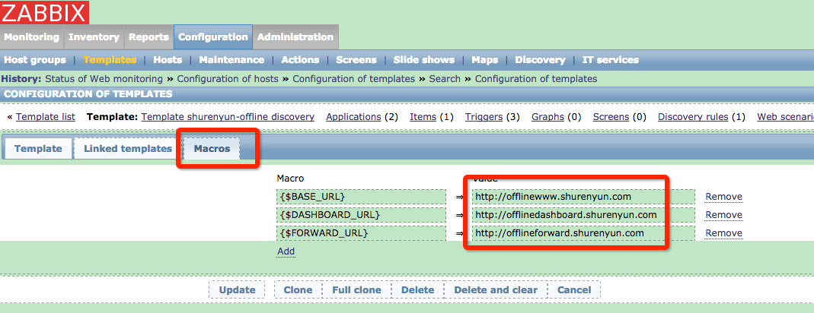
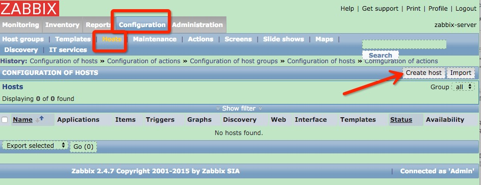
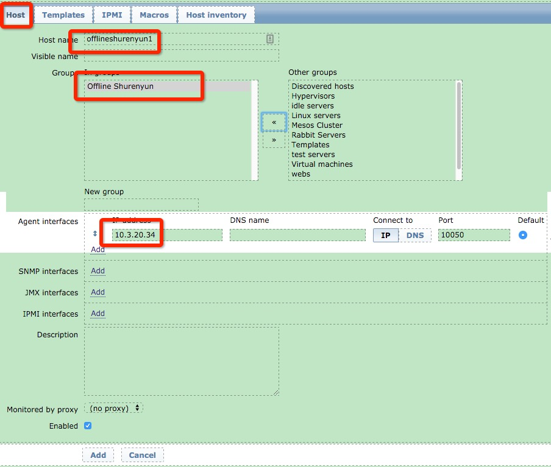
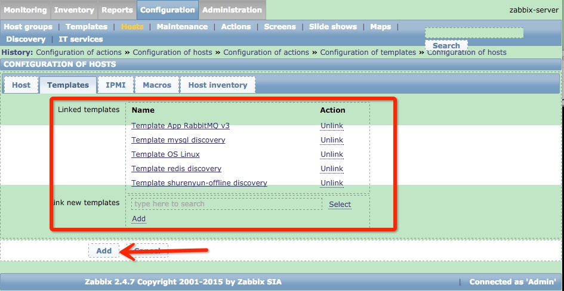
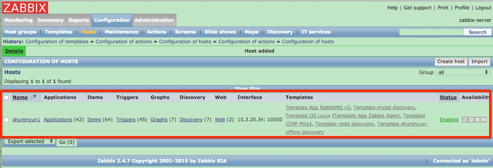

# 部署zabbix server

```
文档信息
创建人 刘金烨
邮件地址 jyliu@dataman-inc.com
建立时间 2016年3月12号
更新时间 2016年6月13号
```

注意: 

如果需要设置各发布任务的CPU、内存资源配置，可以修改app_deploy目录下的发布应用脚本

关键服务资源配置建议
	
关键服务 | 最低主机配置 | 建议主机配置 | 宿主机docker存储要求
-----------|-----------|-----------|-----------
zabbix-web+zabbix-server | 2核 4G内存 | 4核8G内存及以上 | 无
zabbix-mysql | 2核 4G内存 | 4核8G内存及以上| 无
	
## 1. 配置config.cfg

需要注意检查修改的内容 如下：

```
...

# zabbix 使用的configserver地址

CONFIGSERVER_IP="10.3.10.47"    ## Need to check  **必须为当前安装脚本所在的本机IP**
CONFIGSERVER_PORT="8080"          ## Need to check

# zabbix server相关的服务地址

ZBX_WEB_IP="10.3.10.47"         ## Need to check
ZBX_SERVER_IP="10.3.10.47"      ## Need to check

# zabbix mysql 相关的服务信息

ZBX_MYSQL_IP="10.3.10.47"       ## Need to check
ZBX_MYSQL_ROOT_PASS="rootpass"       ## Need to check
ZBX_MYSQL_CHECK_USER="zabbix_check"     
ZBX_MYSQL_CHECK_PASS="zabbixpass"       ## Need to check
ZBX_MYSQL_USER="zabbix"                 
ZBX_MYSQL_PASS="zabbixpass"          ## Need to check
ZBX_MYSQL_DATABASE="zabbix"          
```

## 2. 安装zabbix server

```
./install-zabbix-server.sh
```

zabbix server 管理页面 http://x.x.x.x:9280/

default user: admin

default pass: zabbix

## 3. 安装zabbix agent

安装完成后，会显示zabbix server 的访问地址及安装 zabbix-agent 的脚本链接,在需要监控的主机执行上面命令, 例如：

```
curl -Ls http://10.3.10.47:80/config/zabbix/zabbix-agent/install.sh|bash
```

## 4. 修改线下监控数人云web模板

shurenyun-offline 模板中默认的web监控地址为 offlinewww.shurenyun.com/offlinedashboard.shurenyun.com/offlineforward.shurenyun.com

需要在安装后模板中修改为线下部署实际的地址，如： http://192.168.1.234

如图：






## 5. 在zabbix server 添加数人云主机监控，如果有多台主机，重复下面动作

#### 5.2 点开添加Host页面


#### 5.3 配置Host页面


#### 5.4 配置Host关联的Template

数人云主机关联的模板列表(模板列表根据主机的服务模块酌情修改)

```
Template App RabbitMQ v3
Template mysql discovery
Template OS Linux
Template redis discovery
Template shurenyun-offline discovery
```

小技巧：Link new templates 输入框 "type here to search" ，可以直接填写目录模板搜索再选中



#### 5.5 Host 列表


#### 5.6 添加zabbix server host

添加流程参考前面4项，

zabbix server 添加主机需要关联的模板

```
Template App Zabbix Server
Template OS Linux
```

